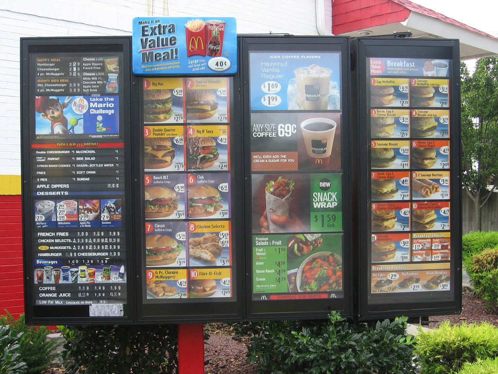
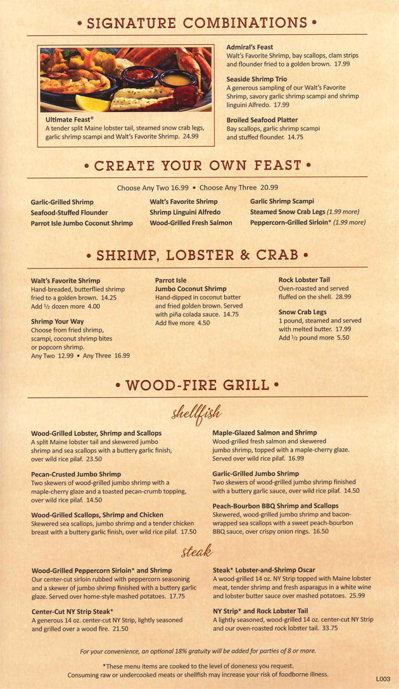
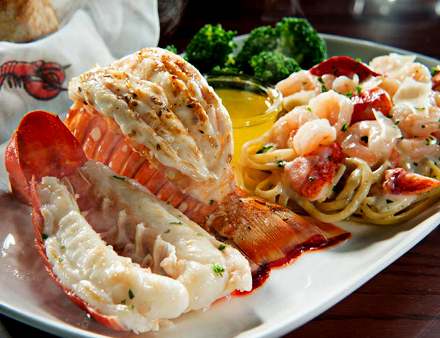
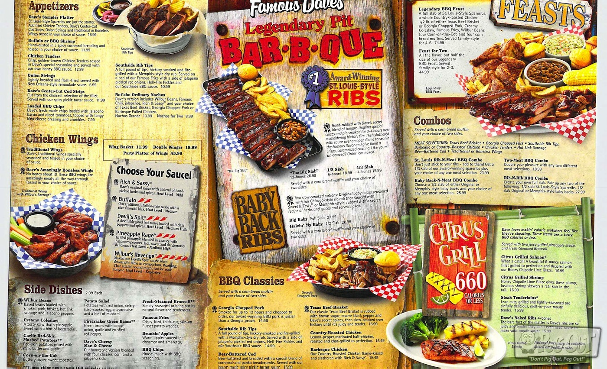
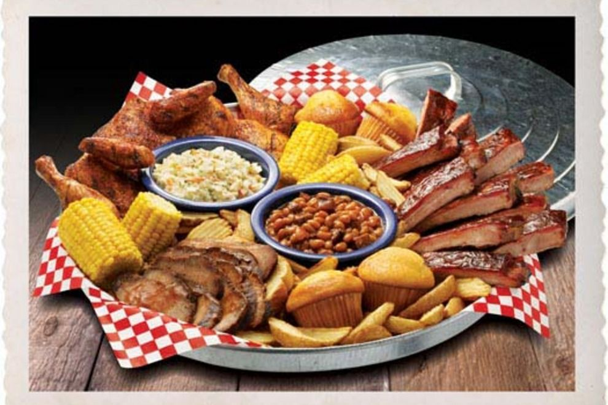
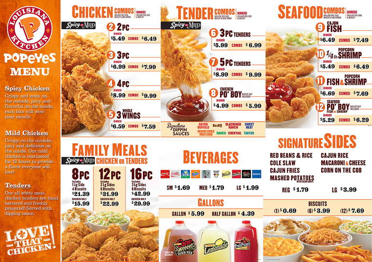

# What is Food?

## Objectives:
By the end of this lesson the students will be able to say 3 basic phrases when ordering food.

## Content Skills

## Key Expressions/Content:
- Cashier: "What would you like to order?"
- Customer: "I want ...."
- Cashier: "You got... {repeat the order}."
- Cashier: "Would you like anything to drink?"
- Cashier: "That will be {price}"

## Materials:
- Paper and markers (if you get a chance to make menus)
- Menus and food pictures
	- 
	- 
	- 
	- 
	- 
	- 
	- 

## Warm up:
### Introduction:
- No Presentation
- [Watch Oliver song](https://github.com/crazcalm/oral-english/blob/master/songs/food_glorious_food.md)

## Presentation:
I will send out the food menus to them and let them review them. I will ask them to pick 5 items that they would like to know more about and then I will go in depth on those food items.

## Practice:
Break them into groups of 4 or so people and let them act out ordering food. One person will be the person taking the order and everyone else will by customers.

Menu: Popeye's or Chinese Food

## Production:
Make their own Food Menu 

## Debrief:

## Anticipated Problems/Activities:

## Back-up Plan/Activities:
- Go over [Al Bundy Clip](https://github.com/crazcalm/oral-english/blob/master/clips/what_is_food.md) 
