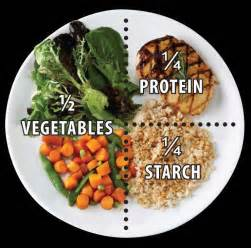

# Protect your home
## Origin
- Show: Married with Children
- Episode: 103
- Time: 00:05:53
- Link to clip: [Youku](http://v.youku.com/v_show/id_XMzA0NjE2NjAxMg==.html?spm=a2h3j.8428770.3416059.1)

## Script:

- Al: I can't believe they stole my radio right in front of my house.

- Steve: I know how you feel.

- Al: If you did Steve, you wouldn't be touching me.

- Marcy: Maybe we should get more involved with the neighborhood watch.

- Al: Look. You can't depend on anybody but yourself. I've put this off long enough. I'm buying a gun.

- Marcy: A gun is not the answer. You can't curtail the criminal element by sinking to their level.

- Al: Oh, excuse me, Miss Let's-run-them-over and-get-out the-fishhooks.

- Marcy: I was upset. I wasn't thinking clearly.

- Peggy: Yes. She wasn't using the left, or analytical, portion of the brain.

- Al: I'm definitely getting a gun. And I'd advise you to do the same.

- Steve: Now, come on. There's got to be a more humane way to protect our home and possessions.

- Marcy: There is. We'll get a dog. A good watch dog.

- Al: A dog. That's a great idea. I've got a dog. Buck, look! Strangers in the house! Kill them, Buck. Go kill them! Whoa, big fella.

- Marcy: I don't mean a stupid dog. I'm talking about a real dog. A guard dog. A Doberman.

- Marcy: Steve, first thing tomorrow, we're going to one of those deadly doggy places.

- Steve: Yes, Al, because we're against guns and the violence they stand for.

- Marcy: That's right.

### Words
- stole: to have taken (another person's property) without permission or legal right and without intending to return it.

- radio: the transmission and reception of electromagnetic waves of radio frequency, especially those carrying sound messages
	+ [Radio](https://cn.bing.com/images/search?q=radio&qs=n&form=QBIR&sp=-1&pq=radio&sc=8-16&sk=&cvid=ECEF7091B9594804B897FC087F7FBE4B), [Car Radio](https://cn.bing.com/images/search?q=cars%20radio&qs=n&form=QBIR&sp=-1&pq=cars%20radio&sc=8-10&sk=&cvid=464B67AAEE564562A33980A56F394CC6)

- involved: connected or concerned with someone or something

- neighborhood watch: a program of systematic local vigilance by residents of a neighborhood to discourage crime, especially burglary
 
- curtail: reduce in extent or quantity

- criminal element: The group of people that commit crimes

- [upset](https://cn.bing.com/images/search?q=upset&qs=n&form=QBIR&sp=-1&pq=upset&sc=8-5&sk=&cvid=E237E39A2EA04ABDA8B327C946A1CD11): a state of being unhappy, disappointed, or worried

- thinking clearly: To be able to clearly think and/or reason about something.

- analytical: using logical reasoning 

- portion: a part of a whole
	+ 

- advice: guidance or recommendations concerning future action

- humane: having or showing compassion or benevolence

- protect: keep safe from harm or injury

- possessions: he state of having, owning, or controlling things

- watch dog: A dog meant to protect the house and the people of the house.

- Big fella: A general term to address a guy 

- [guard dog](https://cn.bing.com/images/search?q=guard%20dog&qs=n&form=QBIR&sp=-1&pq=guard%20dog&sc=0-9&sk=&cvid=304E0613D919419EBB7D586D7A4A4F5E): About the same as Watch dog. 

- [Doberman](https://cn.bing.com/images/search?q=Doberman&qs=n&form=QBIR&sp=-1&pq=doberman&sc=8-8&sk=&cvid=5FD5C66B7DC043F6A64D1519D254BB41): A type of dog

- deadly: causing or able to cause death

### Phrases
- sinking to their level: Doing something as bad as someone else.
- run them over: hit them with a car
- get out the fish hooks: A threat using [fish hooks](https://cn.bing.com/images/search?q=fish+hook&qs=n&form=QBIR&sp=-1&pq=fish+hook&sc=0-0&sk=&cvid=ABAC45DE97704AD58118D77B34049F95)
- I'm definitely {statement} ~ I will {statement}
	- I'm definitely going to do my homework
	- I will do my homework
	- I'm definitely going to call you tonight
	- I will call you tonight
