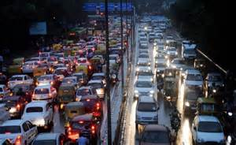
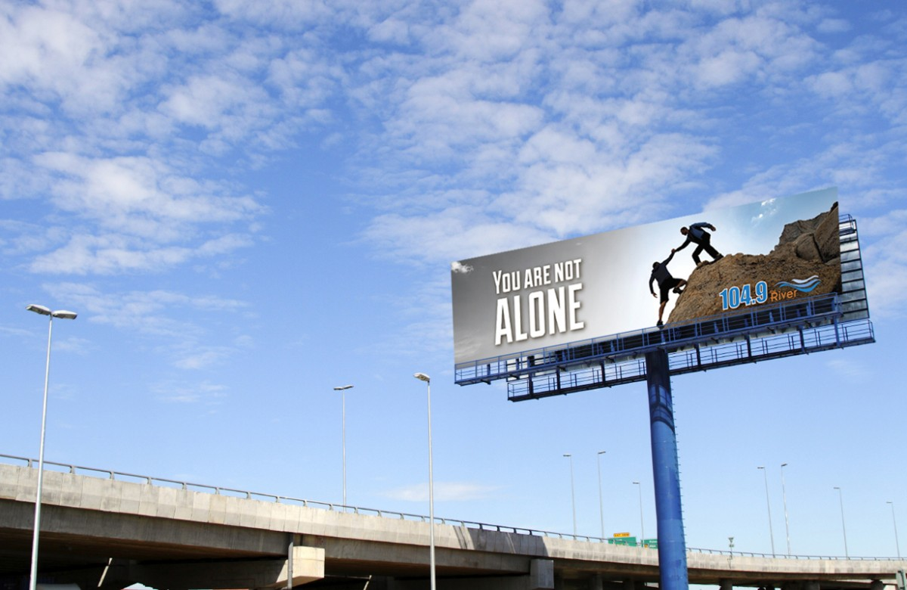
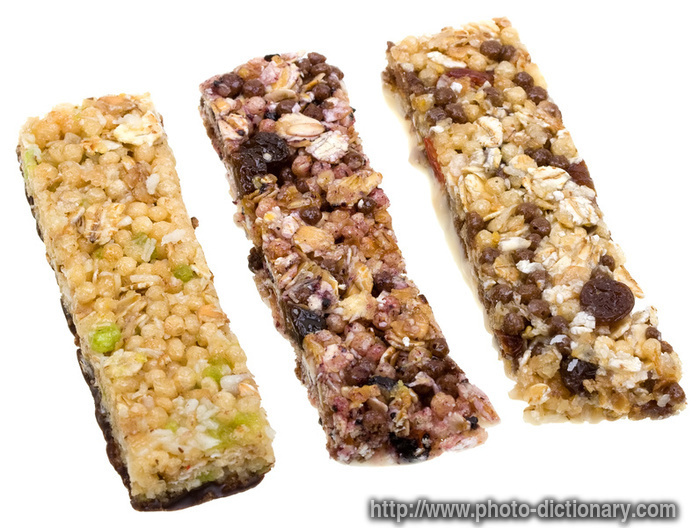

# What is Food
## Origin
- Show: Married With Children
- Episode: 102
- Time: 00:08:45
- Link to clip: [Youku](http://v.youku.com/v_show/id_XMzA0NjE1NzUxNg==.html?spm=a2h3j.8428770.3416059.1)
- Link to clip questions: [Clip Questions](https://github.com/crazcalm/oral-english/blob/master/clip_questions/what_is_food.md)
- Link to discussion questions: [Discussion Questions](https://github.com/crazcalm/oral-english/blob/master/discussion_questions/what_is_food.md)

## Script:
- Son: Hi dad! Hungry!

- Dad: Starving. I didn't have time for lunch, got caught in a traffic jam, and had to sit for 10 minutes staring at a billboard of the best looking burger on a rope I have ever seen. Let's eat!

- Dad: Hi hon!

- Mom: Hi Al. I made something different.

- Dad: I don't care, just slide it in front of me and plenty of it.

- Mom: Okay. Here is comes.

- Dad: Ah, just skip the salad. Let's just eat, okay?

- Mom: That's dinner Al. You've got your  riboflavin, folacin, iron and magnesium, all right there.

- Dad: Come on, Peg. Where's my food?

- Mom: That's it, Al. You finish that, and you can have a granola bar for dessert.

- Daughter: Ooh, beats the heck out of the pie we usually have, huh, Dad?

- Dad: Okay, Peg. What did I do?

- Mom: Nothing. It's good food. It's going to make us much healthier and much more energetic. Try it.

- Dad: Sure.

- Dad: Gee, you know, you're right. I doubted you, but I feel a burst of energy coming.

- Dad: Here it comes now.

- Dad: Here comes another wave. What are you doing to me? I work. I want food. You know what food is? It's hot stuff you put in your mouth. It smells good, you swallow it, and you want more.
That's what food is.

- Mom: Al, the children are here.

- Dad: Oh, I'm sorry.

- Dad: Now, I'm gonna watch the news. And when it's over, I want some form of dead animal on my plate.

### Words
- starving: feel very hungry
- traffic jam: a line of road traffic at or near a standstill because of road construction, an accident, or heavy congestion.
	- 
- billboard: a large outdoor board for displaying advertisements.
	- 
- hon: short for honey (pet name)
- slide: move along a smooth surface while maintaining continuous contact with it
- riboflavin: Vitamin B2
- folacin: Vitamin M
- iron: Dietary supplements containing iron
- magnesium: Dietary supplements containing magnesium
- granola bar: A bar consisting typically of rolled oats, brown sugar or honey, dried fruit, and nuts.
	- 
- dessert: cake, pie, fruit, pudding, ice cream, etc
- healthier: improve your health
- energetic: showing or involving great activity.
- doubted: to no longer feel uncertain about
- swallow: an act of swallowing something, especially food or drink

### Phrases
- burst of energy: Having sudden energy
- Another wave (of energy): Having another burst of energy
- the children are here: Let's not talk about this in front of the kids.