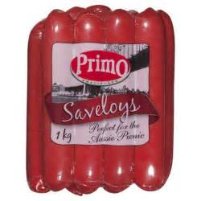

# Oliver Twist (Movie)
## Song
- Food Glorious Food

## Words/Phrases:
- Is it worth the waiting for?
- If we live till eighty four
- All we ever get is gruel!
- Every day we say our prayer
- Will they change the bill of fare?
- Still we get the same old gruel!
- There's not a crust, not a crumb can we find,
- can we beg, can we borrow, or cadge,
- But there's nothing to stop us from getting a thrill
- When we all close our eyes and imagine

- Food, glorious food,
- Hot sausage and mustard!
- While we're in the mood
- Cold jelly and custard!
- Peas pudding and saveloys
- What next is the question?
- Rich gentlemen have it, boys
- in digestion!

- Food Glorious food
- We're anxious to try it
- Three banquets a day
- Our favorite diet
- Just picture a great big steak
- Fried, roasted, or stewed
- Oh food! wonderful food! marvelous
- food! glorious food!

- Food glorious food
- don't care what it looks like
- Burnt underdone crude
- don't CARE what the cooks like
- Just thinking of growing fat
- our senses go reeling
- One moment of knowing that
- Full up feeling

- Food glorious food
- What wouldn't we give for
- That extra bit more
- That's all we live for
- Why should we be fated to do
- Nothing but brood on food
- Magical food,
- Wonderful food
- Marvelous food,
- fabulous food,
- Beautiful food,
- Food, Glorious food glorious food

### Words
- [gruel](https://cn.bing.com/images/search?q=define%3agruel&form=HDRSC2&first=1&cw=1084&ch=533):  thin liquid food of oatmeal or other meal boiled in milk or water.
- prayer: a hope or wish:
- bill of fare: the selection of food available
- [crust](https://cn.bing.com/images/search?q=food%20crust&qs=n&form=QBIR&sp=-1&pq=food%20crust&sc=8-10&sk=&cvid=FC409B67C40943FFAE067F8B9B66D4D4): the tough outer part of a loaf of bread.
- [crumb](https://cn.bing.com/images/search?q=crumbs&qs=n&form=QBIR&sp=-1&pq=crumbs&sc=8-5&sk=&cvid=37FDC8D751A0433197893D839DAEDD79): a small fragment of bread, cake, or cracker
- beg: ask (someone) earnestly or humbly for something
- borrow: take and use (something that belongs to someone else) with the intention of returning it.
- cadge: ask for or obtain (something to which one is not strictly entitled).
- thrill: a sudden feeling of happiness.
- imagine: form a mental image or concept of.
- [sausage](https://cn.bing.com/images/search?q=sausages&qs=SC&form=QBIR&sp=2&pq=suagages&sc=8-8&sk=SC1&cvid=9847DA49968F435FB5AF271862C7935D): meat that has been encased in a skin and cooked
- mustard: yellow or brown paste made from the crushed seeds of certain plants, typically eaten with meat or used as a cooking ingredient.
	- 
- [jelly](https://cn.bing.com/images/search?q=jelly%20food&qs=n&form=QBIR&sp=-1&pq=jelly%20food&sc=8-6&sk=&cvid=225F987658954B928ED5A2F78D84D817): a sweet, clear, semisolid, somewhat elastic spread or preserve made from fruit juice and sugar boiled to a thick consistency
- [custard](https://cn.bing.com/images/search?q=custard&qs=n&form=QBIR&sp=-1&pq=custard&sc=8-7&sk=&cvid=73E88D1A105A4FFE88732987C6A92079): a dessert or sweet sauce made with milk, eggs, and sugar
- [pudding](https://cn.bing.com/images/search?q=Pudding+Desserts&FORM=RESTAB): a dessert with a creamy consistency 
- saveloys: a spicy smoked pork sausage
	- 
- indigestion: pain or discomfort in the stomach associated with difficulty in digesting food 
- anxious: to worry, to be unease, or nervousness
- banquets: formal evening meal for many people
- [fried](https://cn.bing.com/images/search?q=fried%20food&qs=n&form=QBIR&sp=-1&pq=fried%20food&sc=4-10&sk=&cvid=A598043E5AED4833818BF88E685966A4): (of food) cooked in hot fat or oil
- [roasted](https://cn.bing.com/images/search?q=roasting%20food&qs=n&form=QBIR&sp=-1&pq=roasting%20food&sc=8-10&sk=&cvid=A971177336184568A733BCB41027CE32): cook (food, especially meat) by prolonged exposure to heat in an oven or over a fire.
- [stewed](https://cn.bing.com/images/search?q=stewed%20food&qs=n&form=QBIR&sp=-1&pq=stewed%20food&sc=8-7&sk=&cvid=631D6B411BFE48C8A0AC30484CFE6F69): (of food) cooked slowly in liquid in a closed dish or pan
- [burnt](https://cn.bing.com/images/search?q=burnt%20food&qs=n&form=QBIR&sp=-1&pq=burnt%20food&sc=8-8&sk=&cvid=673E56EB2FA948BB92B9234F119EF1A6): overcooked food that has turned black from cooking
- [undercooked](https://cn.bing.com/images/search?q=undercooked%20food&qs=n&form=QBIR&sp=-1&pq=undercooked%20food&sc=8-15&sk=&cvid=B85CA11093694DAC83EB1929AA9C392F): Not cooked enough, opposite of burnt.
- crude: in a natural or raw state.
- senses go reeling: 
- Fill up feeling
- fated
- brood
- Magical
- Wonderful
- Marvelous
- fabulous
- Beautiful